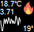
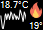
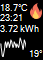
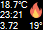
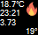
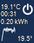
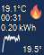
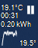

# Home Assistant Climate Deskband

Control a thermostat from you taskbar!

I wanted to have a quicker way to control the thermostat than open the webpage or the app, but have it always available at my fingertips.

## Home Assistant

Home Assistant is a free and open-source home automation software designed to be the central home automation control system for controlling smart home technology.

## Screenshots

 Default view, "Small icons" disabled, single row, 40px, heating (3.71 kWh used today)

 "Small icons" enabled, single row, 30px, heating

 "Small icons" enabled, double row, 60px, heating (temperature last changed at 23:21)

 "Small icons" enabled, single row, 30px, "Prefer Last Change and Power Usage" on, heating

 "Small icons" disabled, single row, 40px, heating

Off, On (Heating) and Pause (temperature OK) state:

At the bottom left you see the history of the last 3 hours.

## My setup

Working from Home since March 2020, and now the winter has arrived, it was getting cold (17°C) in the garage to work all day, sitting still. The wall radiator only provides some warmth when the underfloor heater is asking heat. So I needed some extra heating.

I have a smart power plug connected to Home Assistant which has a electric heater on it. Besides that I have the [Xiaomi LYWSD03MMC](https://a.aliexpress.com/_BSEyaG) Hygrometer, read through an [ESP32](https://a.aliexpress.com/_B1IE4Y) with an [antenna](https://a.aliexpress.com/_B1fp7a). The Xiaomi LYWSD03MMC is flashed with [custom firmware](https://github.com/atc1441/ATC_MiThermometer) made by ATC1441, thanks @ATC1441! This provides faster/better temperature changes and also shows battery.

# Installation

You need Administrator rights!

You need a Long Lived Access Token for the [Home Assistant REST API](https://developers.home-assistant.io/docs/api/rest/).

1.  Download the latest release
2.  Start HAClimateDeskbandInstaller.exe and install
3.  You might get the following screen

If not:

1.  Right click the taskbar, go to Toolbars, check "HA Climate DeskBand". You might have to click twice to make it appear.

# Manual

To open Settings click on the Home Assistant logo in the middle the control.

This will open the Settings window.

**Enable/disable thermostat**

Clicking on the Power icon will turn it on.

Clicking on the Fire or Pause icon will turn it off.

**Increase Temperature**

Click on the temperature on the bottom right.

Scroll up on temperature on the bottom right.

**Decrease Temperature**

Hold CTRL, click on the temperature on the bottom right.

Scroll down on temperature on the bottom right.

# Support

I do NOT provide support for setting up Home Assistant, ESP32, Xiaomi. If you have an issue with the DeskBand itself, create an issue.

If you have any other issue, see the appropriate reference below.

# Build it

You can use a free [Visual Studio 2019+ Community](https://visualstudio.microsoft.com/vs/community/) to build it. Be sure to include the ".NET desktop development" workload.

### System.Reflection.ReflectionTypeLoadException: 'Unable to load one or more of the requested types. Retrieve the LoaderExceptions property for more information.'

When you start it for the first time, it will throw this error.. I don't know why, but I do know how to 'fix' it. Copy Newtonsoft.Json.dll, OxyPlot.dll and OxyPlot.WindowsForms.dll, which are in the bin\\Debug folder, and copy them to the obj\\Debug folder. If anybody knows why this is and has a better fix, please report! :)

# Ideas / Todos

*   Add context menu
*   Hover over it to see a 'popup' with a bigger graph.
*   Restore color after error
*   Improve efficiency, retrieve history graph since last datetime, and don't retrieve every run
*   Replace Newtonsoft.Json?

## Thanks To

@leandrosa81 for letting me know CSDeskBand and for the Installer

## Support

If you like HAClimateDeskBand, please consider supporting me!

[:heart: Sponsor](https://github.com/sponsors/KoalaBear84)

# References

[Home Assistant](https://www.home-assistant.io/)

[HA Generic Thermostat](https://www.home-assistant.io/integrations/generic_thermostat/)

[Home Assistant REST API](https://developers.home-assistant.io/docs/api/rest/)

[Xiaomi LYWSD03MMC](https://a.aliexpress.com/_BSEyaG)

[ATC1441 firmware](https://github.com/atc1441/ATC_MiThermometer)

[ESP32](https://a.aliexpress.com/_B1IE4Y)

[CSDeskBand](https://github.com/dsafa/CSDeskBand)

[HA Community Xiaomi LYWSD03MMC](https://community.home-assistant.io/search?q=Xiaomi%20LYWSD03MMC)
